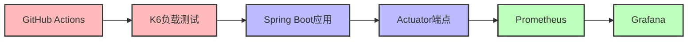

# 🔍 监控和负载测试指南

## 🎯 概述

本项目集成了完整的监控和负载测试解决方案，确保系统性能和稳定性：

### 🏗️ 监控架构
- **Prometheus**: 高性能时序数据库，用于指标收集和存储
- **Grafana**: 强大的可视化仪表板，提供实时监控界面
- **Spring Boot Actuator**: 应用健康检查和指标暴露
- **Micrometer**: 应用指标收集框架

### 🧪 测试架构  
- **K6**: 现代化负载测试工具，支持JavaScript编写测试脚本
- **JMeter**: 传统性能测试工具（可选）
- **Artillery**: 轻量级负载测试（可选）
- **GitHub Actions**: 自动化测试执行

### 📊 数据流向


## 快速开始

### 1. 启动监控系统

```bash
# 启动所有服务（包括监控）
docker-compose up -d

# 或者单独启动监控组件
docker-compose up -d prometheus grafana
```

### 2. 访问监控界面

- **Grafana**: http://localhost:3001
  - 用户名: admin
  - 密码: admin123

- **Prometheus**: http://localhost:9090

- **应用健康检查**: http://localhost:8080/actuator/health

- **应用指标**: http://localhost:8080/actuator/prometheus

### 3. 运行负载测试

#### 方法一：本地运行

```bash
# 安装K6
# Windows: choco install k6
# macOS: brew install k6  
# Linux: sudo apt-get install k6

# 运行测试
cd load-testing
chmod +x run-load-test.sh
./run-load-test.sh
```

#### 方法二：GitHub Actions

1. 在GitHub仓库中，进入 "Actions" 标签
2. 选择 "Load Testing" 工作流
3. 点击 "Run workflow" 手动触发测试

## 📊 监控指标说明

### 🏃 应用性能指标

#### HTTP请求指标
- **请求总数**: `http_requests_total`
- **请求持续时间**: `http_request_duration_seconds`
- **响应状态码分布**: `http_requests_total{status="200|400|500"}`
- **并发请求数**: `http_requests_active`

#### JVM运行时指标
- **堆内存使用**: `jvm_memory_used_bytes{area="heap"}`
- **非堆内存使用**: `jvm_memory_used_bytes{area="nonheap"}`
- **垃圾回收次数**: `jvm_gc_collection_seconds_count`
- **垃圾回收时间**: `jvm_gc_collection_seconds_sum`
- **线程状态**: `jvm_threads_states_threads`

#### 数据库指标
- **连接池活跃连接**: `hikaricp_connections_active`
- **连接池等待连接**: `hikaricp_connections_pending`
- **连接池最大连接**: `hikaricp_connections_max`
- **连接获取时间**: `hikaricp_connections_acquire_seconds`

### 💼 业务指标

#### 用户行为指标
- **用户注册数**: `user_registrations_total`
- **用户登录数**: `user_logins_total`
- **活跃用户数**: `active_users_gauge`

#### 谣言检测指标
- **谣言提交数**: `rumors_submitted_total`
- **谣言分析时间**: `rumor_analysis_duration_seconds`
- **AI分析成功率**: `ai_analysis_success_rate`
- **检测准确率**: `detection_accuracy_gauge`

### 🖥️ 系统基础指标

#### 系统资源
- **CPU使用率**: `system_cpu_usage`
- **系统负载**: `system_load_average_1m`
- **内存使用率**: `system_memory_usage`
- **磁盘使用率**: `disk_usage_ratio`

#### 网络指标
- **网络入站流量**: `network_receive_bytes_total`
- **网络出站流量**: `network_transmit_bytes_total`
- **网络错误包**: `network_receive_errs_total`

## 负载测试场景

### 测试阶段
1. **预热阶段**: 2分钟内增加到20个并发用户
2. **稳定负载**: 保持20个用户5分钟
3. **压力测试**: 2分钟内增加到50个用户  
4. **峰值负载**: 保持50个用户5分钟
5. **缓降阶段**: 2分钟内减少到0个用户

### 性能阈值
- 95%的请求响应时间 < 500ms
- 错误率 < 10%
- 健康检查响应时间 < 200ms
- API响应时间 < 1000ms

### 测试端点
- `/actuator/health` - 健康检查
- `/api/rumors` - 主要业务API
- `/actuator/prometheus` - 指标端点

## 性能基准

### 预期性能指标
- **吞吐量**: >100 requests/second
- **并发用户**: 50个用户同时访问
- **响应时间**: 
  - P50 < 200ms
  - P95 < 500ms
  - P99 < 1000ms
- **可用性**: >99.9%

### 资源使用限制
- **CPU**: <80%
- **内存**: <2GB
- **数据库连接**: <50个活跃连接

## 故障排查

### 常见问题

1. **Prometheus无法采集指标**
   - 检查后端服务是否启动: `curl http://localhost:8080/actuator/health`
   - 检查Prometheus配置: `docker-compose logs prometheus`

2. **Grafana无法连接Prometheus**
   - 检查容器网络: `docker network ls`
   - 检查数据源配置: Grafana -> Configuration -> Data Sources

3. **负载测试失败**
   - 确保后端服务正在运行
   - 检查K6是否正确安装: `k6 version`

### 日志查看

```bash
# 查看所有服务日志
docker-compose logs

# 查看特定服务日志
docker-compose logs backend
docker-compose logs prometheus
docker-compose logs grafana
```

## 自定义扩展

### 添加自定义指标

在Spring Boot应用中添加自定义指标：

```java
@Component
public class CustomMetrics {
    private final Counter userRegistrations;
    private final Timer rumorAnalysisTime;
    
    public CustomMetrics(MeterRegistry meterRegistry) {
        this.userRegistrations = Counter.builder("user_registrations_total")
            .description("Total user registrations")
            .register(meterRegistry);
            
        this.rumorAnalysisTime = Timer.builder("rumor_analysis_duration")
            .description("Time taken to analyze rumors")
            .register(meterRegistry);
    }
}
```

### 自定义Grafana仪表板

1. 在Grafana中创建新仪表板
2. 导出JSON配置
3. 保存到 `monitoring/grafana/dashboards/` 目录

### 扩展负载测试

修改 `load-testing/k6-load-test.js` 添加新的测试场景：

```javascript
// 添加登录测试
let loginResponse = http.post(`${BASE_URL}/api/auth/login`, {
  username: 'testuser',
  password: 'testpass'
});
```

## 🚀 部署到生产环境

### 🔧 环境变量配置

```bash
# .env 文件
GRAFANA_ADMIN_PASSWORD=your_secure_password_here
PROMETHEUS_RETENTION=30d
PROMETHEUS_STORAGE_RETENTION_SIZE=10GB
GRAFANA_INSTALL_PLUGINS=grafana-clock-panel,grafana-simple-json-datasource

# K6配置
K6_PROMETHEUS_RW_SERVER_URL=http://prometheus:9090/api/v1/write
K6_PROMETHEUS_RW_TREND_AS_NATIVE_HISTOGRAM=true
```

### 🛡️ 安全配置

#### Grafana安全
```yaml
# grafana.ini
[security]
admin_user = admin
admin_password = $__env{GRAFANA_ADMIN_PASSWORD}
secret_key = $__env{GRAFANA_SECRET_KEY}
disable_gravatar = true

[auth.anonymous]
enabled = false

[users]
allow_sign_up = false
allow_org_create = false
```

#### Prometheus安全
```yaml
# prometheus.yml
global:
  scrape_interval: 15s
  evaluation_interval: 15s

rule_files:
  - "alert_rules.yml"

scrape_configs:
  - job_name: 'spring-boot-app'
    static_configs:
      - targets: ['backend:8080']
    scrape_interval: 5s
    metrics_path: '/actuator/prometheus'
    basic_auth:
      username: 'prometheus'
      password: 'secure_password'
```

### 💾 数据持久化与备份

#### Docker Compose持久化配置
```yaml
version: '3.8'
services:
  prometheus:
    volumes:
      - prometheus_data:/prometheus
      - ./monitoring/prometheus:/etc/prometheus
    command:
      - '--config.file=/etc/prometheus/prometheus.yml'
      - '--storage.tsdb.path=/prometheus'
      - '--storage.tsdb.retention.time=30d'
      - '--storage.tsdb.retention.size=10GB'
      
  grafana:
    volumes:
      - grafana_data:/var/lib/grafana
      - ./monitoring/grafana/dashboards:/etc/grafana/provisioning/dashboards
      - ./monitoring/grafana/datasources:/etc/grafana/provisioning/datasources

volumes:
  prometheus_data:
  grafana_data:
```

#### 备份策略
```bash
#!/bin/bash
# backup-monitoring.sh

# 备份Prometheus数据
docker run --rm -v prometheus_data:/data -v $(pwd):/backup alpine tar czf /backup/prometheus-backup-$(date +%Y%m%d).tar.gz /data

# 备份Grafana数据
docker run --rm -v grafana_data:/data -v $(pwd):/backup alpine tar czf /backup/grafana-backup-$(date +%Y%m%d).tar.gz /data

# 保留最近30天的备份
find . -name "*-backup-*.tar.gz" -mtime +30 -delete
```

### 🔔 告警配置

#### Prometheus告警规则
```yaml
# alert_rules.yml
groups:
  - name: application_alerts
    rules:
      - alert: HighErrorRate
        expr: rate(http_requests_total{status=~"5.."}[5m]) > 0.1
        for: 5m
        labels:
          severity: critical
        annotations:
          summary: "High error rate detected"
          description: "Error rate is {{ $value }} errors per second"

      - alert: HighMemoryUsage
        expr: jvm_memory_used_bytes{area="heap"} / jvm_memory_max_bytes{area="heap"} > 0.8
        for: 10m
        labels:
          severity: warning
        annotations:
          summary: "High memory usage"
          description: "Memory usage is above 80%"

      - alert: DatabaseConnectionPoolExhausted
        expr: hikaricp_connections_active >= hikaricp_connections_max
        for: 2m
        labels:
          severity: critical
        annotations:
          summary: "Database connection pool exhausted"
          description: "All database connections are in use"
```

### 📈 性能调优

#### Prometheus优化
```yaml
# prometheus.yml优化配置
global:
  scrape_interval: 15s
  evaluation_interval: 15s
  external_labels:
    cluster: 'production'
    replica: '1'

# 启用远程写入（用于长期存储）
remote_write:
  - url: "https://your-remote-storage/api/v1/write"
    write_relabel_configs:
      - source_labels: [__name__]
        regex: 'jvm_.*|http_.*|system_.*'
        action: keep
```

#### Grafana性能优化
```ini
# grafana.ini
[database]
type = postgres
host = postgres:5432
name = grafana
user = grafana
password = grafana_password

[server]
http_port = 3000
domain = grafana.yourdomain.com
root_url = https://grafana.yourdomain.com

[analytics]
reporting_enabled = false
check_for_updates = false
```

### 🌐 反向代理配置

#### Nginx配置
```nginx
# nginx.conf
upstream grafana {
    server grafana:3000;
}

upstream prometheus {
    server prometheus:9090;
}

server {
    listen 443 ssl;
    server_name monitoring.yourdomain.com;
    
    ssl_certificate /etc/ssl/certs/monitoring.crt;
    ssl_certificate_key /etc/ssl/private/monitoring.key;
    
    location /grafana/ {
        proxy_pass http://grafana/;
        proxy_set_header Host $host;
        proxy_set_header X-Real-IP $remote_addr;
        proxy_set_header X-Forwarded-For $proxy_add_x_forwarded_for;
        proxy_set_header X-Forwarded-Proto $scheme;
    }
    
    location /prometheus/ {
        proxy_pass http://prometheus/;
        auth_basic "Prometheus";
        auth_basic_user_file /etc/nginx/.htpasswd;
    }
}
```

### 🔍 监控最佳实践

1. **指标命名规范**
   - 使用标准的Prometheus命名约定
   - 添加适当的标签进行分类
   - 避免高基数标签

2. **告警设计**
   - 设置合理的告警阈值
   - 避免告警风暴
   - 定期审查和调整告警规则

3. **仪表板设计**
   - 关注关键业务指标
   - 使用适当的可视化图表
   - 设置有意义的时间范围

4. **容量规划**
   - 监控存储使用情况
   - 定期清理过期数据
   - 规划硬件资源需求