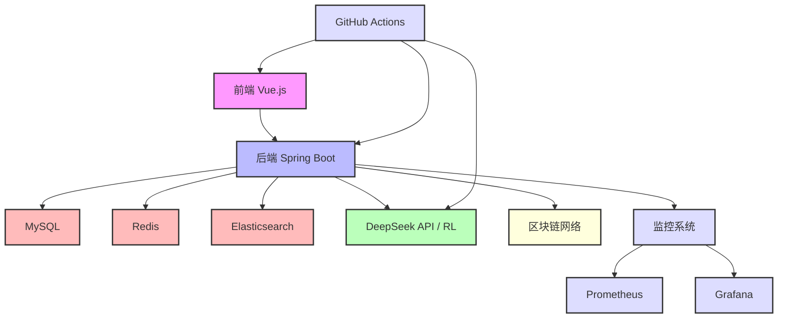
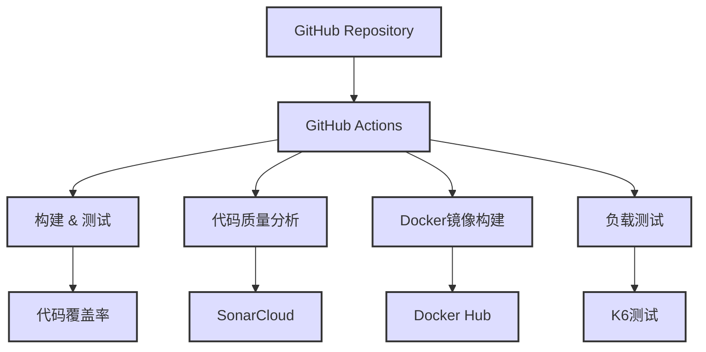
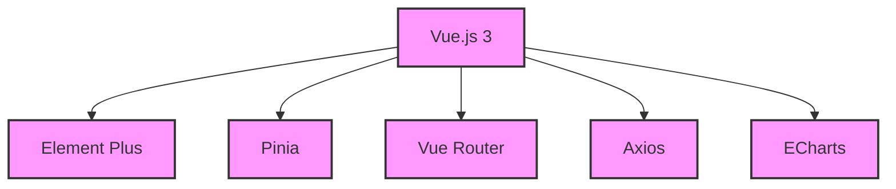
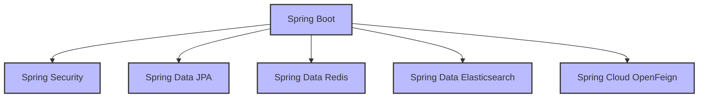
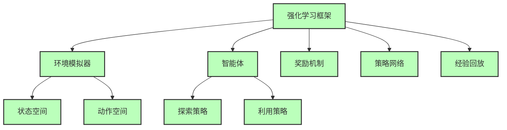
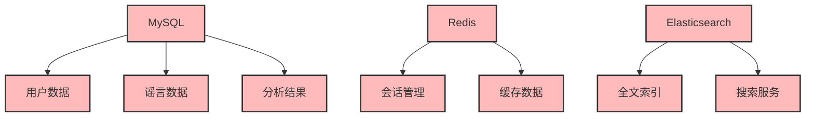
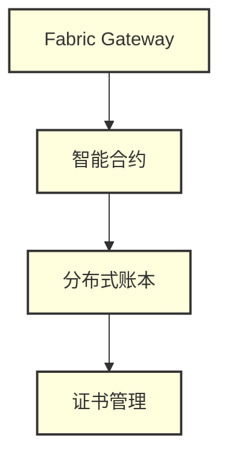

# DeepSeek API与强化学习的区块链谣言溯源系统

## 项目简介

本项目是一个基于DeepSeek API与强化学习的区块链谣言溯源系统，旨在通过人工智能和区块链技术的结合，实现对网络谣言的智能检测、传播路径追踪和可信存证。系统采用前后端分离架构，结合AI模型和区块链技术，为用户提供全面的谣言治理解决方案。

### 系统特点
- **多模态分析**：支持文本、图片、视频等多种形式的内容分析
- **智能传播追踪**：基于强化学习的传播路径分析和预测
- **可信存证**：关键数据上链，确保数据不可篡改
- **实时监控**：提供多维度的数据统计和可视化
- **权限管理**：基于RBAC的细粒度权限控制
- **高可用性**：分布式架构，支持水平扩展
- **安全性**：多重安全机制，保护用户数据
- **完整CI/CD**：GitHub Actions自动化构建、测试、部署
- **监控告警**：Prometheus + Grafana完整监控方案
- **负载测试**：K6自动化性能测试

### 应用场景
- 社交媒体谣言检测
- 新闻真实性验证
- 网络舆情监控
- 虚假信息追踪
- 内容审核辅助

## 系统架构

### 技术栈
- **前端**
  - Vue.js 3.3.11 (需要 Node.js 14+)
  - Element Plus 2.4.4
  - Pinia 2.1.7
  - Vue Router 4.2.5
  - Axios 1.6.2
  - ECharts 5.6.0
  - SASS 1.69.5
  - Vite 6.3.0
  - Vitest (单元测试)
  - ESLint (代码质量)

- **后端**
  - Spring Boot 2.7.12 (需要 JDK 18+)
  - Spring Security
  - Spring Data JPA
  - Spring Data Redis
  - Spring Data Elasticsearch
  - Spring Cloud OpenFeign
  - Spring Data REST
  - Spring Data Envers
  - Spring Boot Actuator (监控指标)
  - MySQL 8.0
  - Redis 6.x
  - Elasticsearch 7.17.4
  - Lombok
  - MapStruct 1.5.3
  - SpringDoc OpenAPI 1.7.0
  - Apache POI 5.2.3

- **AI模型**
  - Python 3.8+
  - TensorFlow 2.x
  - PyTorch
  - DeepSeek API
  - NumPy
  - Pandas
  - Scikit-learn
  - Gymnasium (强化学习环境)
  - Stable Baselines3 (强化学习算法)

- **区块链（基础框架已完成）**
  - Hyperledger Fabric
  - Chaincode (Go语言)
  - Fabric Gateway
  - 事件监听器 (Python)

- **DevOps & 监控**
  - Docker 20.10+
  - Docker Compose
  - GitHub Actions (CI/CD)
  - SonarCloud (代码质量分析)
  - Prometheus (指标收集)
  - Grafana (监控可视化)
  - K6 (负载测试)
  - JaCoCo (代码覆盖率)

### 架构图

#### ① 主系统架构


#### ② DevOps架构


#### ③ 前端架构


#### ④ 后端架构


#### ⑤ AI 模型架构


#### ⑥ 数据存储架构


#### ⑦ 区块链架构（待完善）


## 项目状态

### ✅ 已完成部分

#### 前端应用（Vue.js）
- ✅ 用户认证与授权
- ✅ 谣言管理
- ✅ 传播分析
- ✅ AI分析
- ✅ 日志管理
- ✅ 系统设置
- ✅ 权限管理
- ✅ 评论系统
- ✅ 单元测试框架 (Vitest)
- ✅ ESLint代码检查
- ✅ 响应式设计

#### 后端服务（Spring Boot）
- ✅ RESTful API
- ✅ 用户管理
- ✅ 谣言管理
- ✅ 传播分析
- ✅ AI分析集成
- ✅ 日志系统
- ✅ 权限控制
- ✅ 数据库设计
- ✅ Elasticsearch集成
- ✅ Spring Boot Actuator监控
- ✅ 单元测试框架 (JUnit)
- ✅ 代码覆盖率报告 (JaCoCo)

#### AI模型框架（Python）
- ✅ 数据收集模块
- ✅ 数据预处理模块
- ✅ 模型训练框架
- ✅ 模型评估框架
- ✅ 可视化工具
- ✅ DeepSeek API集成
- ✅ 基础部署脚本
- ✅ 强化学习基础框架
  - ✅ 环境定义
  - ✅ 基础算法实现 (PPO, DQN, A2C)
  - ✅ 奖励机制设计
  - ✅ 状态空间定义
  - ✅ 动作空间定义
  - ✅ 经验回放机制
  - ✅ 多智能体支持

#### 区块链模块（基础框架）
- ✅ Hyperledger Fabric网络配置
- ✅ 智能合约 (Chaincode) 框架
- ✅ 事件监听器
- ✅ 网络启动/停止脚本
- ✅ 基础存证功能

#### DevOps & 监控
- ✅ GitHub Actions CI/CD流水线
  - ✅ 自动化构建
  - ✅ 单元测试执行
  - ✅ 代码质量分析 (SonarCloud)
  - ✅ Docker镜像构建与推送
  - ✅ 多环境部署支持
- ✅ 监控系统
  - ✅ Prometheus指标收集
  - ✅ Grafana监控面板
  - ✅ 应用健康检查
  - ✅ 性能指标监控
- ✅ 负载测试
  - ✅ K6性能测试脚本
  - ✅ 自动化负载测试
  - ✅ 性能基准设定
  - ✅ 测试报告生成
- ✅ 代码质量保证
  - ✅ ESLint前端代码检查
  - ✅ SonarCloud代码分析
  - ✅ 代码覆盖率报告
  - ✅ 安全扫描

### 🔄 待完善部分

#### AI模型优化
- 🔄 强化学习模型深度优化
  - 算法参数调优
  - 多智能体协调机制
  - 迁移学习应用
  - 在线学习优化
- 🔄 模型训练数据扩充
- 🔄 模型A/B测试框架
- 🔄 模型版本管理

#### 区块链完善
- 🔄 智能合约业务逻辑完善
- 🔄 数据上链自动化
- 🔄 存证验证机制
- 🔄 区块链监控集成

#### 高级运维
- 🔄 Kubernetes配置
- 🔄 服务网格 (Istio)
- 🔄 分布式追踪
- 🔄 自动扩缩容

## 快速开始

### 环境要求

- JDK 18+
- Node.js 14+
- MySQL 8.0+
- Redis 6.x+
- Elasticsearch 7.17.4+
- Maven 3.8+
- Git 2.30+
- Python 3.8+
- Docker 20.10+

### 本地开发

1. **克隆项目**
```bash
git clone https://github.com/muchuan77/DeekseekAPI.git
cd DeepSeek_API
```

2. **配置数据库**
```sql
CREATE DATABASE rumor_tracing CHARACTER SET utf8mb4 COLLATE utf8mb4_unicode_ci;
```

3. **启动后端**
```bash
cd backend
mvn clean install
mvn spring-boot:run
```

4. **启动前端**
```bash
cd frontend
npm install
npm run dev
```

5. **启动监控系统** (可选)
```bash
# 启动完整监控栈
docker-compose up -d prometheus grafana

# 访问监控面板
# Grafana: http://localhost:3001 (admin/admin123)
# Prometheus: http://localhost:9090
```

6. **运行负载测试** (可选)
```bash
cd load-testing
chmod +x run-load-test.sh
./run-load-test.sh
```

### Docker部署

使用Docker Compose启动所有服务：

```bash
docker-compose up -d
```

## 监控和测试

### 🔍 监控系统
- **Grafana仪表板**: http://localhost:3001 (admin/admin123)
- **Prometheus指标**: http://localhost:9090
- **应用健康检查**: http://localhost:8080/actuator/health
- **应用指标**: http://localhost:8080/actuator/prometheus

### 📊 负载测试
- **测试场景**: 50个并发用户，多阶段负载测试
- **性能基准**: P95响应时间 < 500ms，错误率 < 10%
- **自动化测试**: GitHub Actions集成，定期执行

### 🔧 代码质量
- **SonarCloud**: 代码质量分析和技术债务管理
- **代码覆盖率**: JaCoCo + Vitest覆盖率报告
- **安全扫描**: 依赖漏洞检测和安全最佳实践

详细信息请参考：[监控和负载测试指南](MONITORING_LOAD_TESTING.md)

## 项目文档

### 核心文档
- [前端开发指南](frontend/README.md) - 前端架构和开发说明
- [后端开发指南](backend/README.md) - 后端架构和API说明
- [AI模型文档](ai-model/README.md) - AI模型和强化学习说明
- [区块链文档](blockchain/README.md) - 区块链架构和智能合约
- [监控测试指南](MONITORING_LOAD_TESTING.md) - 监控和负载测试说明

### API文档
- [前端API文档](frontend/API.md) - 前端接口说明
- [后端API文档](backend/API.md) - 后端接口详细说明
- [数据库设计文档](backend/DATABASE_SCHEMA.md) - 数据库结构说明

## 开发规范

### 代码规范
- **前端**: Vue.js风格指南 + ESLint + Prettier
- **后端**: 阿里巴巴Java开发手册 + Checkstyle + Spotless
- **AI模型**: PEP 8规范 + Pylint + Black

### Git工作流
- **main**: 生产环境分支
- **develop**: 开发分支
- **feature/***: 功能分支
- **hotfix/***: 紧急修复分支

### 提交规范
遵循 Conventional Commits 规范：
- `feat`: 新功能
- `fix`: 修复
- `docs`: 文档
- `style`: 格式
- `refactor`: 重构
- `test`: 测试
- `chore`: 构建过程或辅助工具的变动

## 性能指标

### 当前性能基准
- **吞吐量**: >100 requests/second
- **并发用户**: 50个用户同时访问
- **响应时间**: P95 < 500ms
- **可用性**: >99.9%
- **错误率**: <10%

### 资源使用
- **CPU**: <80%
- **内存**: <2GB
- **数据库连接**: <50个活跃连接

## 版本历史

- **v1.2.0** (2024-12) - 当前版本
  - ✅ 完整CI/CD流水线
  - ✅ 监控和负载测试系统
  - ✅ 代码质量保证体系
  - ✅ Docker化部署
  - ✅ 强化学习基础框架
  - ✅ 区块链基础模块

- **v1.1.0** (2024-11)
  - ✅ 后端核心功能完善
  - ✅ 前端用户界面优化
  - ✅ 数据库设计完成
  - ✅ API文档完善

- **v1.0.0** (2024-04)
  - ✅ 前端基础功能实现
  - ✅ 后端基础功能实现
  - ✅ AI模型基础框架搭建

## 许可证

本项目采用 MIT 许可证，详见 [LICENSE](LICENSE) 文件。

## 联系方式

- **项目负责人**: Electric_cat
- **邮箱**: electriccat408@gmail.com
- **技术支持**: Brain and heart

## 致谢

感谢以下开源项目的支持：
- Spring Boot, Vue.js, DeepSeek
- Element Plus, Elasticsearch, Redis, MySQL
- TensorFlow, PyTorch, Gymnasium
- Prometheus, Grafana, K6
- GitHub Actions, SonarCloud, Docker
