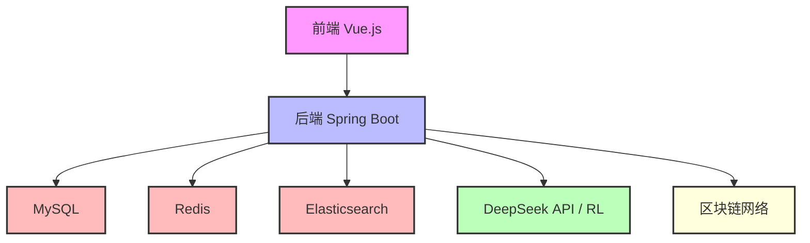
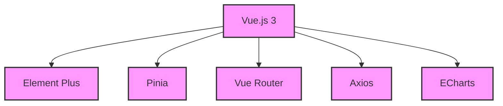
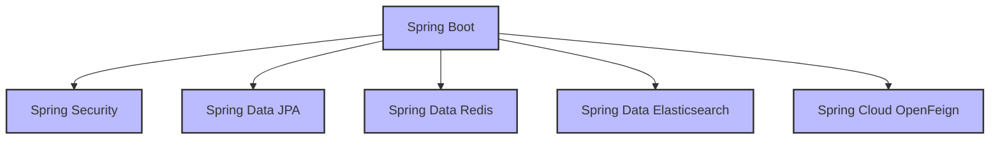
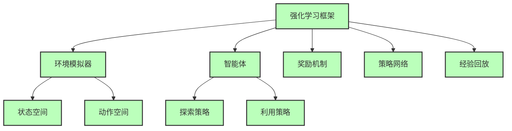
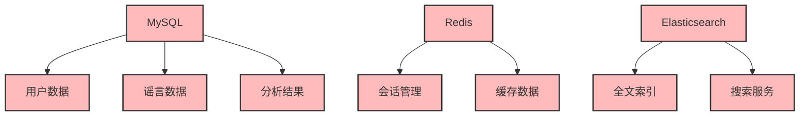
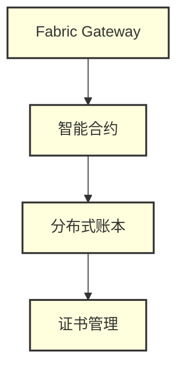

# DeepSeek API与强化学习的区块链谣言溯源系统

## 项目简介

本项目是一个基于DeepSeek API与强化学习的区块链谣言溯源系统，旨在通过人工智能和区块链技术的结合，实现对网络谣言的智能检测、传播路径追踪和可信存证。系统采用前后端分离架构，结合AI模型和区块链技术，为用户提供全面的谣言治理解决方案。

### 系统特点
- 多模态分析：支持文本、图片、视频等多种形式的内容分析
- 智能传播追踪：基于强化学习的传播路径分析和预测
- 可信存证：关键数据上链，确保数据不可篡改
- 实时监控：提供多维度的数据统计和可视化
- 权限管理：基于RBAC的细粒度权限控制
- 高可用性：分布式架构，支持水平扩展
- 安全性：多重安全机制，保护用户数据

### 应用场景
- 社交媒体谣言检测
- 新闻真实性验证
- 网络舆情监控
- 虚假信息追踪
- 内容审核辅助

## 系统架构

### 技术栈
- 前端
  - Vue.js 3.3.11 (需要 Node.js 14+)
  - Element Plus 2.4.4
  - Pinia 2.1.7
  - Vue Router 4.2.5
  - Axios 1.6.2
  - ECharts 5.6.0
  - SASS 1.69.5
  - Vite 6.3.0

- 后端
  - Spring Boot 2.7.12 (需要 JDK 18+)
  - Spring Security
  - Spring Data JPA
  - Spring Data Redis
  - Spring Data Elasticsearch
  - Spring Cloud OpenFeign
  - Spring Data REST
  - Spring Data Envers
  - MySQL 8.0
  - Redis 6.x
  - Elasticsearch 7.17.4
  - Lombok
  - MapStruct 1.5.3
  - SpringDoc OpenAPI 1.7.0
  - Apache POI 5.2.3

- AI模型
  - Python 3.8+
  - TensorFlow 2.x
  - PyTorch
  - DeepSeek API
  - NumPy
  - Pandas
  - Scikit-learn
  - Gymnasium
  - Stable Baselines3

- 区块链（待完善）
  - Hyperledger Fabric
  - Solidity
  - Web3.js
  - Truffle

- 部署（待完善）
  - Docker 20.10+
  - Docker Compose
  - Kubernetes
  - Jenkins
  - Prometheus
  - Grafana

### 架构图

#### ① 主系统架构


#### ② 前端架构


#### ③ 后端架构



#### ④ AI 模型架构



#### ⑤ 数据存储架构


#### ⑥ 区块链架构（待完善）


## 项目状态

### 已完成部分
- 前端应用（Vue.js）
  - 用户认证与授权
  - 谣言管理
  - 传播分析
  - AI分析
  - 日志管理
  - 系统设置
  - 权限管理
  - 评论系统

- 后端服务（Spring Boot）
  - RESTful API
  - 用户管理
  - 谣言管理
  - 传播分析
  - AI分析集成
  - 日志系统
  - 权限控制
  - 数据库设计
  - Elasticsearch集成

- AI模型基础框架（Python）
  - 数据收集模块
  - 数据预处理模块
  - 模型训练框架
  - 模型评估框架
  - 可视化工具
  - DeepSeek API集成
  - 基础部署脚本
  - 强化学习基础框架
    - 环境定义
    - 基础算法实现
    - 奖励机制设计
    - 状态空间定义
    - 动作空间定义

### 待完善部分
- AI模型完善
  - 强化学习模型优化
    - 算法优化与改进
    - 多智能体强化学习
    - 迁移学习应用
    - 模型泛化能力提升
    - 在线学习机制
    - 探索与利用平衡
    - 奖励函数优化
    - 策略网络优化
  - 模型训练数据扩充
  - 模型性能调优
  - 模型部署优化
  - 模型监控系统
  - 模型版本管理
  - 模型A/B测试
  - 模型回滚机制

- 区块链模块
  - 数据上链
  - 智能合约
  - 存证验证

- 部署方案
  - Kubernetes配置
  - 监控系统
  - 自动化部署

## 快速开始

### 环境要求

- JDK 18+
- Node.js 14+
- MySQL 8.0+
- Redis 6.x+
- Elasticsearch 7.17.4+
- Maven 3.8+
- Git 2.30+
- Python 3.8+
- Docker 20.10+

### 环境准备

1. 安装必要的开发工具
```bash
# Windows
winget install OpenJDK.JDK.18
winget install OpenJS.NodeJS.LTS
winget install Python.Python.3.8
winget install Docker.DockerDesktop

# Linux (Ubuntu/Debian)
sudo apt update
sudo apt install openjdk-18-jdk nodejs python3.8 docker.io
```

2. 配置开发环境
```bash
# 配置Java环境变量
export JAVA_HOME=/path/to/jdk18
export PATH=$JAVA_HOME/bin:$PATH

# 配置Node.js环境
npm config set registry https://registry.npmmirror.com

# 配置Python环境
python -m pip install --upgrade pip
pip config set global.index-url https://pypi.tuna.tsinghua.edu.cn/simple
```

### 本地开发

1. 克隆项目
```bash
git clone https://github.com/muchuan77/DeekseekAPI.git
cd DeepSeek_API
```

2. 配置数据库
```sql
CREATE DATABASE rumor_tracing CHARACTER SET utf8mb4 COLLATE utf8mb4_unicode_ci;
```

3. 启动后端
```bash
cd backend
mvn clean install
mvn spring-boot:run
```

4. 启动前端
```bash
cd frontend
npm install
npm run dev
```

5. 启动AI模型服务
```bash
cd ai-model
pip install -r requirements.txt
python train.py
```

### 常见问题解决

1. 数据库连接失败
   - 检查MySQL服务是否启动
   - 验证数据库连接信息
   - 检查网络连接
   - 检查连接池配置

2. Redis连接问题
   - 检查Redis服务状态
   - 验证Redis配置
   - 检查防火墙设置
   - 检查网络连接

3. Elasticsearch连接问题
   - 检查Elasticsearch服务状态
   - 验证Elasticsearch配置
   - 检查网络连接
   - 检查索引状态

4. 前端依赖安装失败
   - 清除npm缓存：`npm cache clean --force`
   - 使用淘宝镜像：`npm config set registry https://registry.npmmirror.com`
   - 重新安装：`npm install`

5. 后端编译失败
   - 检查Maven配置
   - 清理Maven缓存：`mvn clean`
   - 更新依赖：`mvn dependency:purge-local-repository`
   - 重新编译：`mvn clean install`

### Docker部署（待完善）

使用Docker Compose启动所有服务：

```bash
cd deployment
docker-compose up -d
```

### Kubernetes部署（待完善）

1. 创建命名空间
```bash
kubectl create namespace rumor-tracing
```

2. 部署服务
```bash
kubectl apply -f deployment/kubernetes/
```

## 项目文档

### 核心文档
- [前端API文档](frontend/API.md) - 前端接口说明
- [前端README](frontend/README.md) - 前端开发指南
- [后端API文档](backend/API.md) - 后端接口说明
- [后端README](backend/README.md) - 后端开发指南
- [数据库设计文档](backend/DATABASE_SCHEMA.md) - 数据库结构说明

### 待完善文档
- [环境配置指南](docs/environment.md) - 开发环境配置说明
- [区块链模块文档](docs/blockchain.md) - 区块链功能说明
- [强化学习模块文档](docs/reinforcement-learning.md) - 强化学习功能说明
- [部署指南](docs/deployment.md) - 部署说明

## 开发规范

### 代码规范
- 前端
  - 遵循 Vue.js 风格指南
  - 使用 ESLint 进行代码检查
  - 使用 Prettier 进行代码格式化
  - 组件命名采用 PascalCase
  - 变量命名采用 camelCase
  - 常量命名采用 UPPER_SNAKE_CASE
  - 文件命名采用 kebab-case
  - 注释使用 JSDoc 规范

- 后端
  - 遵循阿里巴巴Java开发手册
  - 使用 Checkstyle 进行代码检查
  - 使用 Spotless 进行代码格式化
  - 类命名采用 PascalCase
  - 方法命名采用 camelCase
  - 常量命名采用 UPPER_SNAKE_CASE
  - 包命名采用小写字母
  - 注释使用 JavaDoc 规范

- AI模型
  - 遵循 PEP 8 规范
  - 使用 Pylint 进行代码检查
  - 使用 Black 进行代码格式化
  - 类命名采用 PascalCase
  - 函数命名采用 snake_case
  - 变量命名采用 snake_case
  - 常量命名采用 UPPER_SNAKE_CASE
  - 注释使用 Google 风格

### 提交规范
- 遵循 Conventional Commits 规范
- 提交信息格式：`<type>(<scope>): <description>`
- 类型：
  - feat: 新功能
  - fix: 修复
  - docs: 文档
  - style: 格式
  - refactor: 重构
  - test: 测试
  - chore: 构建过程或辅助工具的变动

### 分支管理
- main：主分支，用于生产环境
- develop：开发分支
- feature/*：功能分支
- hotfix/*：紧急修复分支
- release/*：发布分支

## 版本历史

- v1.0.0 (2024-04)
  - 前端基础功能实现
  - 后端基础功能实现
  - 数据库设计完成
  - API文档完善
  - AI模型基础框架搭建
    - 基础模型框架
    - 强化学习基础框架
  - 待完善：AI模型优化（特别是强化学习部分）、区块链模块、部署方案

## 许可证

本项目采用 MIT 许可证，详见 [LICENSE](LICENSE) 文件。

## 联系方式

- 项目负责人：[Electric_cat]
- 邮箱：[electriccat408@gmail.com]
- 技术支持：[Brain and heart]

## 致谢

感谢以下开源项目的支持：
- Spring Boot
- Vue.js
- DeepSeek
- Element Plus
- Elasticsearch
- Redis
- MySQL
- TensorFlow
- PyTorch
- Gymnasium
