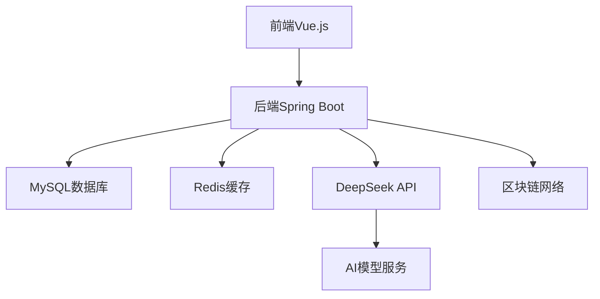

# DeepSeek API与强化学习的区块链谣言溯源系统

## 项目简介

本项目是一个基于DeepSeek API与强化学习的区块链谣言溯源系统，旨在通过人工智能和区块链技术的结合，实现对网络谣言的智能检测、传播路径追踪和可信存证。系统采用前后端分离架构，结合AI模型和区块链技术，为用户提供全面的谣言治理解决方案。

## 系统架构

### 技术栈
- 前端：Vue.js 3.x + Element Plus
- 后端：Spring Boot 2.x + MySQL 8.0 + Redis
- AI模型：DeepSeek API + TensorFlow
- 区块链：Hyperledger Fabric
- 部署：Docker + Kubernetes

### 架构图


## 主要功能

1. 谣言检测
   - 文本内容检测
   - 图片内容识别
   - 视频内容分析
   - 多模态融合分析

2. 传播追踪
   - 传播路径可视化
   - 传播趋势分析
   - 影响力评估
   - 关键节点识别

3. 区块链存证
   - 信息上链存证
   - 存证记录验证
   - 智能合约管理
   - 溯源查询

4. 用户管理
   - 多角色权限控制
   - 操作日志记录
   - 个性化设置

## 快速开始

### 环境要求

- JDK 11+
- Node.js 14+
- MySQL 8.0+
- Redis 6.x+
- Docker 20.10+
- Kubernetes 1.20+

### 本地开发

1. 克隆项目
```bash
git clone https://github.com/your-repo/rumor-tracing.git
cd rumor-tracing
```

2. 配置数据库
```sql
CREATE DATABASE rumor_tracing CHARACTER SET utf8mb4 COLLATE utf8mb4_unicode_ci;
```

3. 启动后端
```bash
cd backend
mvn clean install
mvn spring-boot:run
```

4. 启动前端
```bash
cd frontend
npm install
npm run serve
```

### Docker部署

使用Docker Compose启动所有服务：

```bash
cd deployment
docker-compose up -d
```

### Kubernetes部署

1. 创建命名空间
```bash
kubectl create namespace rumor-tracing
```

2. 部署服务
```bash
kubectl apply -f deployment/kubernetes/
```

## 项目文档

- [API文档](docs/api.md)
- [用户手册](docs/user.md)
- [开发指南](docs/development.md)
- [架构文档](docs/architecture.md)
- [部署文档](docs/deployment.md)
- [测试文档](docs/testing.md)

## 开发规范

### 代码规范
- 后端：阿里巴巴Java开发手册
- 前端：Vue.js风格指南
- 提交信息：Angular提交规范

### 分支管理
- main：主分支，用于生产环境
- develop：开发分支
- feature/*：功能分支
- hotfix/*：紧急修复分支

## 贡献指南

1. Fork 项目
2. 创建功能分支
3. 提交代码
4. 发起Pull Request

## 版本历史

- v1.0.0 (2024-01)
  - 基础功能实现
  - 谣言检测模块
  - 传播追踪模块
  - 区块链存证模块

## 许可证

本项目采用 MIT 许可证，详见 [LICENSE](LICENSE) 文件。

## 联系方式

- 项目负责人：[姓名]
- 邮箱：[邮箱地址]
- 技术支持：[支持邮箱]

## 致谢

感谢以下开源项目的支持：
- Spring Boot
- Vue.js
- DeepSeek
- Hyperledger Fabric
- 等
