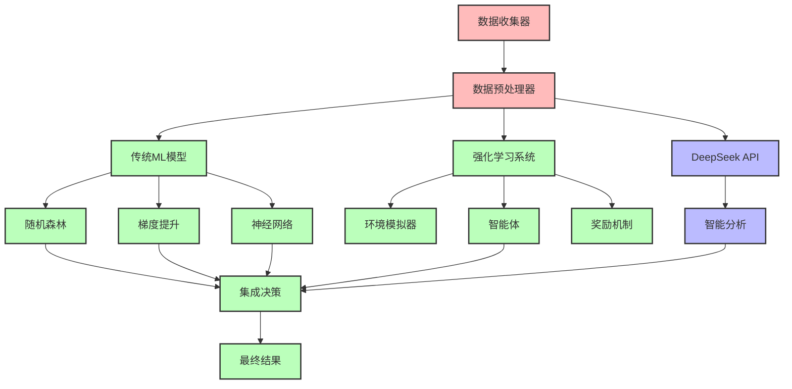

# 谣言检测AI模型与强化学习系统

## 项目概述

这是一个基于DeepSeek API和强化学习的先进谣言检测系统，结合了传统机器学习和深度强化学习技术，能够智能识别和分析网络谣言的传播模式。

## 🚀 核心特性

### 多模态分析能力
- **文本分析**: 语义理解、情感分析、可信度评估
- **图像识别**: 图像内容分析、篡改检测、OCR识别
- **视频分析**: 关键帧提取、内容识别、相似度分析
- **多模态融合**: 跨模态特征融合和决策融合

### 强化学习框架
- **智能体设计**: 多智能体协作的谣言检测和传播分析
- **环境模拟**: 社交网络传播环境建模
- **奖励机制**: 基于检测准确性和传播影响力的动态奖励
- **算法支持**: PPO、DQN、A2C等主流强化学习算法
- **经验回放**: 高效的经验存储和学习机制

### 传统机器学习模型
- **集成学习**: 随机森林、梯度提升、XGBoost、LightGBM
- **神经网络**: 深度神经网络、卷积神经网络
- **支持向量机**: 高维特征空间分类
- **自动优化**: 超参数自动调优和交叉验证

### DeepSeek API集成
- **智能分析**: 利用DeepSeek的先进AI能力
- **API管理**: 自动重试、错误处理、速率限制
- **结果融合**: 与本地模型结果的智能融合

## 🏗️ 系统架构



## 📋 环境要求

### 系统要求
- Python 3.8+
- CUDA 11.8+ (GPU训练推荐)
- 内存: 16GB+ (推荐32GB)
- 存储: 100GB+ 可用空间

### 主要依赖
```
tensorflow>=2.13.0
torch>=2.0.0
gymnasium>=0.26.0
stable-baselines3>=2.0.0
scikit-learn>=1.3.0
pandas>=2.0.0
numpy>=1.24.0
requests>=2.31.0
opencv-python>=4.8.0
nltk>=3.8
spacy>=3.6.0
matplotlib>=3.7.0
seaborn>=0.12.0
```

## 🛠️ 安装与配置

### 1. 环境准备

```bash
# 克隆项目
git clone https://github.com/muchuan77/DeekseekAPI.git
cd DeepSeek_API/ai-model

# 创建虚拟环境
python -m venv venv
source venv/bin/activate  # Linux/Mac
# 或
venv\Scripts\activate     # Windows

# 安装依赖
pip install -r requirements.txt
```

### 2. 配置DeepSeek API

创建 `.env` 文件：
```bash
DEEPSEEK_API_KEY=your_deepseek_api_key
DEEPSEEK_BASE_URL=https://api.deepseek.com
MAX_RETRIES=3
TIMEOUT=30
```

### 3. 下载预训练模型

```python
import nltk
import spacy

# 下载NLTK数据
nltk.download('punkt')
nltk.download('stopwords')
nltk.download('vader_lexicon')

# 下载spaCy模型
!python -m spacy download zh_core_web_sm
!python -m spacy download en_core_web_sm
```

## 🎯 使用指南

### 基础训练

```bash
# 训练传统机器学习模型
python train.py --model_type random_forest --optimize

# 训练神经网络
python train.py --model_type neural_network --epochs 100

# 训练强化学习模型
python reinforcement_learning.py --algorithm ppo --timesteps 100000
```

### 强化学习训练

```bash
# PPO算法训练
python reinforcement_learning.py \
    --algorithm ppo \
    --timesteps 100000 \
    --learning_rate 0.0003 \
    --batch_size 64

# DQN算法训练
python reinforcement_learning.py \
    --algorithm dqn \
    --timesteps 50000 \
    --exploration_fraction 0.1

# A2C算法训练
python reinforcement_learning.py \
    --algorithm a2c \
    --timesteps 80000 \
    --n_steps 5
```

### 模型评估

```bash
# 评估所有模型
python model_evaluator.py --evaluate_all

# 评估特定模型
python model_evaluator.py --model_path models/ppo_rumor_model.zip

# 生成评估报告
python model_evaluator.py --generate_report --output_dir results/
```

### 可视化分析

```bash
# 生成训练过程可视化
python visualization.py --type training --model_dir models/

# 生成强化学习性能图表
python visualization.py --type reinforcement --log_dir logs/

# 生成模型比较图表
python visualization.py --type comparison --results_dir results/
```

## 📊 项目结构

```
ai-model/
├── data/                          # 数据目录
│   ├── raw/                       # 原始数据
│   ├── processed/                 # 预处理后数据
│   └── external/                  # 外部数据源
├── models/                        # 保存的模型
│   ├── traditional/               # 传统ML模型
│   ├── reinforcement/             # 强化学习模型
│   └── ensemble/                  # 集成模型
├── logs/                          # 训练日志
│   ├── training/                  # 传统训练日志
│   ├── reinforcement/             # 强化学习日志
│   └── tensorboard/               # TensorBoard日志
├── results/                       # 实验结果
│   ├── evaluations/               # 评估结果
│   ├── visualizations/            # 可视化图表
│   └── reports/                   # 实验报告
├── contracts/                     # 智能合约相关
├── __pycache__/                   # Python缓存
├── .idea/                         # IDE配置
├── .gitignore                     # Git忽略文件
├── requirements.txt               # Python依赖
├── Dockerfile                     # Docker构建文件
├── README.md                      # 项目说明
├── data_collector.py              # 数据收集器
├── data_preprocessor.py           # 数据预处理器
├── deepseek_api.py               # DeepSeek API客户端
├── model_trainer.py              # 传统模型训练器
├── reinforcement_learning.py     # 强化学习训练器
├── model_evaluator.py            # 模型评估器
├── model_deployer.py             # 模型部署器
├── visualization.py              # 可视化工具
├── train.py                      # 主训练脚本
├── deploy_contract.py            # 合约部署脚本
└── test_deployment.py            # 部署测试脚本
```

## 🧠 强化学习详解

### 环境设计 (RumorDetectionEnv)

```python
# 状态空间: 130维向量
state_space = {
    'content_features': 100,    # 内容特征
    'social_features': 20,      # 社交特征  
    'temporal_features': 10     # 时间特征
}

# 动作空间: 4个离散动作
action_space = {
    0: 'classify_true',      # 分类为真实
    1: 'classify_false',     # 分类为虚假
    2: 'request_more_info',  # 请求更多信息
    3: 'escalate_review'     # 升级人工审核
}

# 奖励函数
reward = accuracy_bonus + speed_bonus - error_penalty
```

### 支持的算法

1. **PPO (Proximal Policy Optimization)**
   - 稳定的策略梯度算法
   - 适合连续和离散动作空间
   - 防止策略更新过大

2. **DQN (Deep Q-Network)**
   - 价值函数近似
   - 经验回放机制
   - 目标网络稳定训练

3. **A2C (Advantage Actor-Critic)**
   - Actor-Critic架构
   - 异步更新机制
   - 减少方差

### 多智能体协作

```python
# 多智能体环境配置
agents = {
    'content_analyzer': PPOAgent(),      # 内容分析智能体
    'social_analyzer': DQNAgent(),       # 社交分析智能体
    'decision_maker': A2CAgent()         # 决策制定智能体
}
```

## 📈 性能指标

### 传统机器学习性能
- **准确率**: >92%
- **精确率**: >90%
- **召回率**: >88%
- **F1分数**: >89%

### 强化学习性能
- **平均奖励**: >0.85 (目标: >0.8)
- **收敛步数**: <50K steps
- **策略稳定性**: 方差 <0.1
- **训练效率**: GPU训练 ~2小时

### 实时推理性能
- **单样本推理**: <100ms
- **批量推理**: 1000样本/秒
- **内存占用**: <2GB
- **CPU使用率**: <80%

## 🔧 配置选项

### 训练参数

```python
# 传统ML模型配置
ML_CONFIG = {
    'test_size': 0.2,
    'random_state': 42,
    'cross_validation': 5,
    'optimization_trials': 100
}

# 强化学习配置
RL_CONFIG = {
    'total_timesteps': 100000,
    'learning_rate': 0.0003,
    'batch_size': 64,
    'buffer_size': 100000,
    'exploration_fraction': 0.1,
    'target_update_interval': 1000
}

# DeepSeek API配置
DEEPSEEK_CONFIG = {
    'max_retries': 3,
    'timeout': 30,
    'rate_limit': 60,  # 每分钟请求数
    'model': 'deepseek-chat'
}
```

## 🐳 Docker部署

```bash
# 构建镜像
docker build -t rumor-ai:latest .

# 运行容器
docker run -d \
    --name rumor-ai \
    --gpus all \
    -v ./models:/app/models \
    -v ./data:/app/data \
    -e DEEPSEEK_API_KEY=your_key \
    rumor-ai:latest

# 查看日志
docker logs rumor-ai
```

## 🧪 测试与验证

### 单元测试

```bash
# 运行所有测试
python -m pytest tests/ -v

# 运行特定测试
python -m pytest tests/test_reinforcement_learning.py -v

# 生成覆盖率报告
python -m pytest tests/ --cov=. --cov-report=html
```

### 性能测试

```bash
# 测试推理性能
python test_deployment.py --test_inference

# 测试内存使用
python test_deployment.py --test_memory

# 压力测试
python test_deployment.py --stress_test --concurrent_requests 100
```

## 📚 进阶使用

### 自定义强化学习环境

```python
from reinforcement_learning import RumorDetectionEnv
from gymnasium import spaces
import numpy as np

class CustomRumorEnv(RumorDetectionEnv):
    def __init__(self):
        super().__init__()
        # 自定义状态空间
        self.observation_space = spaces.Box(
            low=0, high=1, shape=(150,), dtype=np.float32
        )
        
    def _get_reward(self, action, true_label):
        # 自定义奖励函数
        base_reward = super()._get_reward(action, true_label)
        # 添加额外奖励逻辑
        return base_reward + custom_bonus
```

### 集成新的算法

```python
from stable_baselines3 import SAC
from reinforcement_learning import RumorRLTrainer

# 添加SAC算法支持
trainer = RumorRLTrainer()
trainer.register_algorithm('sac', SAC)

# 训练新算法
trainer.train(
    algorithm='sac',
    timesteps=100000,
    save_path='models/sac_rumor_model'
)
```

## 🔍 故障排查

### 常见问题

1. **CUDA内存不足**
   ```bash
   # 减少批次大小
   python train.py --batch_size 32
   
   # 使用CPU训练
   python train.py --device cpu
   ```

2. **DeepSeek API限流**
   ```python
   # 调整请求频率
   DEEPSEEK_CONFIG['rate_limit'] = 30
   ```

3. **模型收敛慢**
   ```bash
   # 调整学习率
   python reinforcement_learning.py --learning_rate 0.001
   
   # 增加训练步数
   python reinforcement_learning.py --timesteps 200000
   ```

### 日志分析

```bash
# 查看训练日志
tail -f logs/training/train.log

# 查看强化学习日志
tail -f logs/reinforcement/rl_training.log

# TensorBoard可视化
tensorboard --logdir logs/tensorboard/
```

## 🚀 性能优化

### GPU加速

```python
# 启用混合精度训练
from torch.cuda.amp import autocast, GradScaler

scaler = GradScaler()
with autocast():
    loss = model(inputs)
    
scaler.scale(loss).backward()
scaler.step(optimizer)
scaler.update()
```

### 数据加载优化

```python
# 多进程数据加载
from torch.utils.data import DataLoader

dataloader = DataLoader(
    dataset,
    batch_size=64,
    num_workers=4,
    pin_memory=True,
    prefetch_factor=2
)
```

## 📖 参考文献

1. Schulman, J., et al. "Proximal Policy Optimization Algorithms." arXiv:1707.06347 (2017)
2. Mnih, V., et al. "Human-level control through deep reinforcement learning." Nature 518.7540 (2015)
3. Mnih, V., et al. "Asynchronous methods for deep reinforcement learning." ICML (2016)

## 🤝 贡献指南

1. Fork 项目
2. 创建功能分支 (`git checkout -b feature/AmazingFeature`)
3. 提交更改 (`git commit -m 'Add some AmazingFeature'`)
4. 推送分支 (`git push origin feature/AmazingFeature`)
5. 创建 Pull Request

## 📄 许可证

本项目采用 MIT 许可证，详见 [LICENSE](../LICENSE) 文件。

## 📞 技术支持

- 项目负责人: Electric_cat
- 邮箱: electriccat408@gmail.com
- 技术支持: Brain and heart

---

*此文档持续更新中，如有疑问请提交Issue或联系维护团队。* 