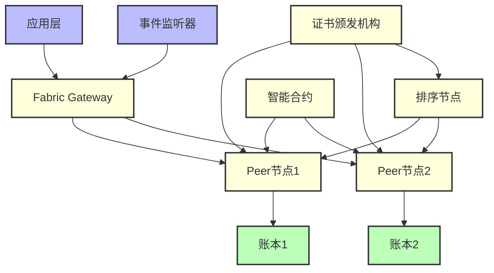

# 区块链存证系统

## 项目概述

基于 Hyperledger Fabric 的区块链存证系统，为谣言溯源系统提供不可篡改的数据存证服务。系统包含智能合约（Chaincode）、网络配置、事件监听器等核心组件。

## 🏗️ 系统架构

### 区块链网络架构



### 核心组件

- **智能合约 (Chaincode)**: Go语言编写的业务逻辑
- **网络配置**: Hyperledger Fabric网络拓扑
- **事件监听器**: Python编写的区块链事件监听服务
- **证书管理**: PKI证书体系管理
- **数据存证**: 谣言数据的不可篡改存储

## 🚀 核心功能

### 数据存证
- **谣言记录存证**: 谣言内容、分析结果的上链存储
- **分析结果存证**: AI分析结果的可信存储
- **操作日志存证**: 关键操作的不可篡改记录
- **用户行为存证**: 重要用户行为的链上记录

### 智能合约功能
- **数据写入**: 将关键数据写入区块链
- **数据查询**: 查询链上存储的数据
- **权限控制**: 基于身份的访问控制
- **数据验证**: 数据完整性和真实性验证

### 事件系统
- **实时监听**: 监听区块链上的事件
- **事件处理**: 处理合约事件并触发相应操作
- **状态同步**: 与后端系统的状态同步
- **告警通知**: 异常事件的告警机制

## 📋 环境要求

### 系统要求
- Linux/macOS (推荐 Ubuntu 20.04+)
- Docker 20.10+
- Docker Compose 2.0+
- Go 1.18+ (智能合约开发)
- Python 3.8+ (事件监听器)
- Node.js 16+ (客户端SDK)

### Hyperledger Fabric版本
- Fabric 2.4.x
- Fabric CA 1.5.x
- Fabric Gateway 1.0.x

## 🛠️ 安装与配置

### 1. 环境准备

```bash
# 克隆项目
git clone https://github.com/muchuan77/DeekseekAPI.git
cd DeepSeek_API/blockchain

# 安装Hyperledger Fabric二进制文件
curl -sSL https://bit.ly/2ysbOFE | bash -s -- 2.4.7 1.5.4

# 添加到PATH
export PATH=${PWD}/bin:$PATH
export FABRIC_CFG_PATH=${PWD}/config
```

### 2. 网络配置

```bash
# 生成加密材料
cryptogen generate --config=./network/crypto-config.yaml

# 生成创世区块
configtxgen -profile TwoOrgsOrdererGenesis -channelID system-channel -outputBlock ./network/genesis.block

# 生成通道配置
configtxgen -profile TwoOrgsChannel -outputCreateChannelTx ./network/channel.tx -channelID rumortracing
```

### 3. 启动网络

```bash
# 启动网络
cd network
./start.sh

# 验证网络状态
docker ps
```

### 4. 部署智能合约

```bash
# 打包链码
peer lifecycle chaincode package rumor.tar.gz --path ./chaincode/rumor --lang golang --label rumor_1.0

# 安装链码
peer lifecycle chaincode install rumor.tar.gz

# 批准链码定义
peer lifecycle chaincode approveformyorg -o localhost:7050 --channelID rumortracing --name rumor --version 1.0 --package-id $PACKAGE_ID --sequence 1

# 提交链码定义
peer lifecycle chaincode commit -o localhost:7050 --channelID rumortracing --name rumor --version 1.0 --sequence 1
```

### 5. 启动事件监听器

```bash
# 安装Python依赖
pip install -r requirements.txt

# 启动事件监听器
python event_listener.py
```

## 📊 项目结构

```
blockchain/
├── network/                        # 网络配置文件
│   ├── crypto-config.yaml         # 加密配置
│   ├── configtx.yaml             # 通道配置
│   ├── docker-compose.yaml       # Docker网络配置
│   ├── start.sh                   # 网络启动脚本
│   ├── stop.sh                    # 网络停止脚本
│   └── test-chaincode.sh          # 链码测试脚本
├── chaincode/                      # 智能合约目录
│   └── rumor/                     # 谣言存证合约
│       ├── main.go                # 合约主文件
│       ├── rumor.go              # 合约业务逻辑
│       ├── models.go             # 数据模型
│       └── go.mod                # Go模块定义
├── java/                          # Java客户端SDK
│   └── src/                       # Java源码
├── contracts/                      # 合约相关文件
├── target/                         # 编译输出目录
├── event_listener.py              # 事件监听器
├── pom.xml                        # Maven配置
├── package.json                   # Node.js配置
├── Dockerfile                     # Docker构建文件
└── README.md                      # 项目文档
```

## 🔧 智能合约接口

### 数据存证接口

#### 1. 存储谣言数据
```go
// StoreRumorData 存储谣言数据
func (s *SmartContract) StoreRumorData(ctx contractapi.TransactionContextInterface, 
    rumorID string, content string, source string, timestamp string) error
```

#### 2. 查询谣言数据
```go
// QueryRumorData 查询谣言数据
func (s *SmartContract) QueryRumorData(ctx contractapi.TransactionContextInterface, 
    rumorID string) (*RumorData, error)
```

#### 3. 存储分析结果
```go
// StoreAnalysisResult 存储AI分析结果
func (s *SmartContract) StoreAnalysisResult(ctx contractapi.TransactionContextInterface, 
    rumorID string, result string, confidence float64, timestamp string) error
```

#### 4. 查询分析结果
```go
// QueryAnalysisResult 查询分析结果
func (s *SmartContract) QueryAnalysisResult(ctx contractapi.TransactionContextInterface, 
    rumorID string) (*AnalysisResult, error)
```

### 数据模型

```go
// RumorData 谣言数据结构
type RumorData struct {
    RumorID     string `json:"rumorId"`
    Content     string `json:"content"`
    Source      string `json:"source"`
    Timestamp   string `json:"timestamp"`
    Hash        string `json:"hash"`
    Creator     string `json:"creator"`
}

// AnalysisResult 分析结果结构
type AnalysisResult struct {
    RumorID     string  `json:"rumorId"`
    Result      string  `json:"result"`
    Confidence  float64 `json:"confidence"`
    Algorithm   string  `json:"algorithm"`
    Timestamp   string  `json:"timestamp"`
    Analyst     string  `json:"analyst"`
}

// OperationLog 操作日志结构
type OperationLog struct {
    LogID       string `json:"logId"`
    Operation   string `json:"operation"`
    UserID      string `json:"userId"`
    Timestamp   string `json:"timestamp"`
    Details     string `json:"details"`
}
```

## 🔍 事件监听器

### 事件类型

1. **谣言存证事件**
   - 新谣言数据上链
   - 谣言状态更新

2. **分析结果事件**
   - AI分析完成
   - 人工审核结果

3. **系统事件**
   - 权限变更
   - 配置更新

### 事件处理

```python
# 事件监听器示例
class BlockchainEventListener:
    def __init__(self):
        self.gateway = Gateway()
        self.network = None
        self.contract = None
    
    async def listen_events(self):
        """监听区块链事件"""
        async for event in self.contract.newListener("RumorStored"):
            await self.handle_rumor_stored(event)
    
    async def handle_rumor_stored(self, event):
        """处理谣言存储事件"""
        rumor_id = event.payload.decode('utf-8')
        # 通知后端系统
        await self.notify_backend(rumor_id)
```

## 🧪 测试与验证

### 1. 网络测试

```bash
# 测试网络连通性
./network/test-chaincode.sh

# 查看容器状态
docker ps -a

# 查看日志
docker logs peer0.org1.example.com
```

### 2. 智能合约测试

```bash
# 调用合约存储数据
peer chaincode invoke -o localhost:7050 -C rumortracing -n rumor -c '{"function":"StoreRumorData","Args":["rumor1","test content","social media","2024-01-01T00:00:00Z"]}'

# 查询数据
peer chaincode query -C rumortracing -n rumor -c '{"function":"QueryRumorData","Args":["rumor1"]}'
```

### 3. 事件监听测试

```python
# 测试事件监听
python test_event_listener.py

# 模拟事件触发
python simulate_events.py
```

## 📈 性能指标

### 网络性能
- **TPS**: ~1000 transactions/second
- **延迟**: <2秒确认时间
- **吞吐量**: 支持10MB/s数据写入
- **节点数**: 支持最多50个节点

### 存储性能
- **数据大小**: 单条记录最大1MB
- **查询速度**: <100ms响应时间
- **存储容量**: 支持TB级数据存储
- **数据完整性**: 100%不可篡改

## 🛡️ 安全特性

### 身份认证
- **PKI证书体系**: 基于X.509证书的身份认证
- **MSP管理**: 多重签名提供商管理
- **权限控制**: 基于角色的访问控制

### 数据安全
- **加密存储**: 敏感数据的加密存储
- **哈希验证**: 数据完整性验证
- **不可篡改**: 区块链的不可篡改特性

### 网络安全
- **TLS通信**: 节点间的加密通信
- **防篡改**: 分布式账本防篡改
- **审计日志**: 完整的操作审计记录

## 🐳 Docker部署

### 1. 使用Docker Compose

```yaml
# docker-compose.yml
version: '3.8'
services:
  orderer:
    image: hyperledger/fabric-orderer:2.4
    environment:
      - FABRIC_LOGGING_SPEC=INFO
      - ORDERER_GENERAL_BOOTSTRAPMETHOD=file
    ports:
      - "7050:7050"
    
  peer0-org1:
    image: hyperledger/fabric-peer:2.4
    environment:
      - CORE_PEER_ID=peer0.org1.example.com
      - CORE_PEER_NETWORKID=rumortracing
    ports:
      - "7051:7051"
```

### 2. 构建自定义镜像

```bash
# 构建镜像
docker build -t rumor-blockchain:latest .

# 运行容器
docker run -d \
    --name rumor-blockchain \
    -p 7050:7050 \
    -v ./network:/opt/network \
    rumor-blockchain:latest
```

## 🔍 故障排查

### 常见问题

1. **网络启动失败**
   ```bash
   # 清理容器和网络
   docker-compose down
   docker system prune -f
   # 重新启动
   ./network/start.sh
   ```

2. **链码安装失败**
   ```bash
   # 检查链码路径
   ls -la ./chaincode/rumor/
   # 重新打包安装
   peer lifecycle chaincode package rumor.tar.gz --path ./chaincode/rumor --lang golang --label rumor_1.0
   ```

3. **事件监听连接失败**
   ```python
   # 检查连接配置
   connection_profile = {
       "peers": {
           "peer0.org1.example.com": {
               "url": "grpc://localhost:7051"
           }
       }
   }
   ```

### 日志分析

```bash
# 查看节点日志
docker logs peer0.org1.example.com 2>&1 | grep ERROR

# 查看排序节点日志
docker logs orderer.example.com

# 查看事件监听器日志
tail -f event_listener.log
```

## 🚀 性能优化

### 网络优化

```yaml
# 优化配置示例
peer:
  batchTimeout: 2s
  batchSize:
    maxMessageCount: 500
    absoluteMaxBytes: 10MB
    preferredMaxBytes: 2MB
```

### 存储优化

```bash
# 使用高性能存储
mount -t ext4 /dev/nvme0n1 /var/hyperledger/production
```

## 🔄 CI/CD集成

### GitHub Actions工作流

```yaml
name: Blockchain CI/CD
on: [push, pull_request]

jobs:
  test-chaincode:
    runs-on: ubuntu-latest
    steps:
      - uses: actions/checkout@v3
      - name: Setup Go
        uses: actions/setup-go@v3
        with:
          go-version: 1.18
      - name: Test Chaincode
        run: |
          cd chaincode/rumor
          go test -v ./...
```

## 📚 参考文档

1. [Hyperledger Fabric官方文档](https://hyperledger-fabric.readthedocs.io/)
2. [Fabric SDK Go文档](https://github.com/hyperledger/fabric-sdk-go)
3. [智能合约开发指南](https://hyperledger-fabric.readthedocs.io/en/release-2.4/chaincode.html)

## 🤝 贡献指南

1. Fork 项目
2. 创建功能分支 (`git checkout -b feature/blockchain-enhancement`)
3. 提交更改 (`git commit -m 'Add blockchain feature'`)
4. 推送分支 (`git push origin feature/blockchain-enhancement`)
5. 创建 Pull Request

## 📄 许可证

本项目采用 MIT 许可证，详见 [LICENSE](../LICENSE) 文件。

## 📞 技术支持

- 项目负责人: Electric_cat
- 邮箱: electriccat408@gmail.com
- 技术支持: Brain and heart

---

*此文档持续更新中，如有疑问请提交Issue或联系维护团队。* 